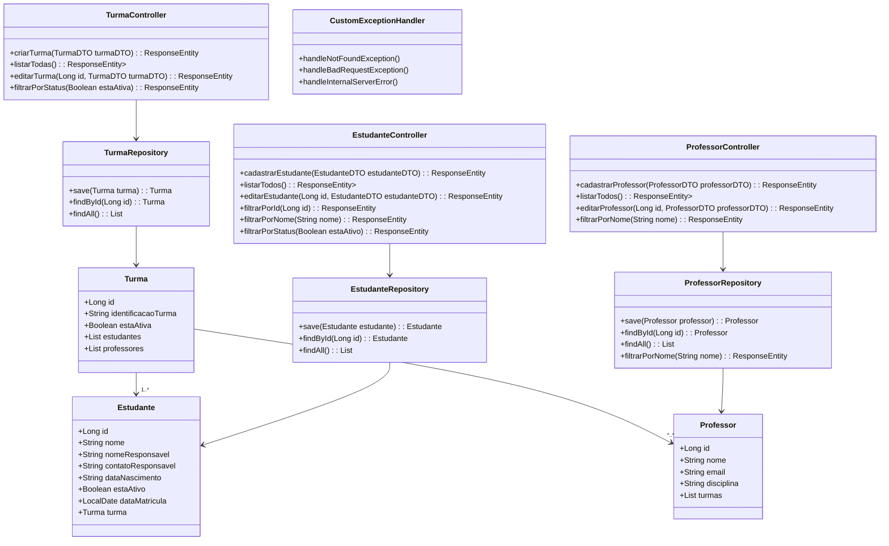
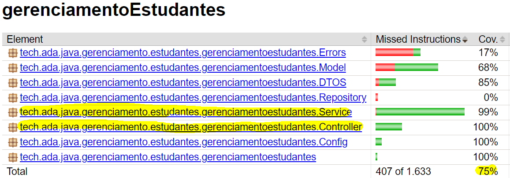




# Sistema de Gerenciamento de Estudantes


Este projeto trata-se de uma API para um sistema de gerenciamento de estudantes, contendo as funcionalidades básicas
para cadastrar e matricular alunos em uma turma, cadastrar e atribuir professores a uma turma. Também é possível
obter as listas de turmas, estudantes e professores, e alterar os dados desses objetos.

## Diagrama de Classe



## Índice

- [Ferramentas Utilizadas](#ferramentas-utilizadas)
- [Pré-requisitos](#pré-requisitos)
- [Métodos Implementados](#métods)
- [Documentação da API](#documentação-da-api)
- [Métodos de busca e listagem](#métodos-de-busca-e-listagem)
- [Testes Unitários](#mtestes-unitários)
- [Autoras](#autoras)


## Ferramentas utilizadas


**Back-end:**
- Java
- Spring Boot
- PostgreSQL
- H2
- Authentication
- JUnit
- Mockito
- JaCoCo
## Pré-requisitos

Java instalado (versão 17 ou superior) e conexão com o banco de dados H2 ou Postgres. 
Para utilizar a API será necessário colocar o USUÁRIO e SENHA, tanto no banco de dados 
quanto na plataforma usada para fazer as requisições HTTPs.

## Métodos Implementados

<details>
<summary>Estudantes </summary>
<br>

- [X]  `GET` **`/estudante`**
- [X]  `POST` **`/estudante`**
- [X]  `PATCH` **`/estudante/{id}`**
- [X]  `PUT` **`/estudante/{id}`**
- [X]  `GET` **`/estudante?nomeAluno`**
- [X]  `GET` **`/estudante?status=`**
</details>

<details>
<summary>Professores</summary>
<br>

- [X]  `POST` **`/professor`**
- [X]  `PUT` **`/professor/:id`**
- [X]  `GET` **`/professor`**
- [X]  `GET` **`/professor?nomeProfessor`**
- [X]  `PATCH` **`/professor/:id`**

</details>

<details>
<summary>Turma</summary>
<br>

- [X]  `POST` **`/turma`**
- [X]  `PUT` **`/turma/{id}`**
- [X]  `GET` **`/turma`**
- [X]  `GET` **`/turma/{id}`**
- [X]  `PATCH` **`/turma/{id}`**

</details>

## Documentação da API

#### Cadastrar Estudante

```http
  POST /estudante
```

| Parâmetro            | Tipo       | Descrição        |
|:---------------------| :--------- |:-----------------|
| `nomeAluno`          | `string` | **Obrigatório**. |
| `nomeResponsável`    | `string` | **Obrigatório**. |
| `contatoResponsável` | `string` | **Obrigatório**. |
| `estaAtivo`          | `string` | **Obrigatório**. |
*Exemplo:*
```json
// Corpo da requisição para cadastro de aluno 

{
  "nomeAluno": "Ana Clara",
  "nomeResponsavel": "Luiz",
  "dataNascimento": "02/12/1994",
  "contatoResponsavel": "19 99634535",
  "estaAtivo:" true
  
}
```
*Exemplo de Resposta*
```json
{
"id": 4,
"estaAtivo": true,
"nomeAluno": "Ana Clara",
"dataNascimento": "02/12/1994",
"nomeResponsavel": "Luiz",
"contatoResponsavel": "19 99634535",
"dataDeCadastro": "2024-02-25T16:21:44.029981",
"dataAtualizacao": null
}
```


#### Atualizar TODOS os dados de um estudante.
```http
  PUT /estudante/id
```
Método utilizado para atualizar todos os dados do estudante.

| Parâmetro            | Tipo       | Descrição                           |
|:---------------------| :--------- | :---------------------------------- |
| `nomeAluno`          | `string` | **Obrigatório**.  |
| `nomeResponsável`    | `string` | **Obrigatório**. |
| `contatoResponsável` | `string` | **Obrigatório**. |
| `dataNascimento`     | `string` | **Obrigatório**. |


#### Atualizar um ou mais atributo do estudante
```http
  PATCH /estudante/id
```

| Parâmetro            | Tipo       | Descrição     |
|:---------------------| :--------- |:--------------|
| `nomeAluno`          | `string` | **Opcional**. |
| `nomeResponsável`    | `string` | **Opcional**. |
| `contatoResponsável` | `string` | **Opcional**. |
| `dataNascimento`     | `string` | **Opcional**. |
| `turma_id`           | `string` | **Opcional**. |


#### Criar turma

```http
  POST /turma
```

| Parâmetro   | Tipo      | Descrição                                   |
|:------------|:----------| :------------------------------------------ |
| `nomeTurma` | `string`  | **Obrigatório**.  |
| `estaAtiva` | `boolean` | **Obrigatório**. .|
**Exemplo:**
```json
{
"nomeTurma": "Programação Web II",
"estaAtiva": true
}
```
#### Alterar informações da turma
```http
  PUT e PATCH /turma/id
```
| Parâmetro             | Tipo       | Descrição                                                              |
|:----------------------| :--------- |:-----------------------------------------------------------------------|
| `nomeTurma`           | `string` | **Obrigatório para PUT e Opcional para PATCH**.                        |
| `estaAtiva`           | `string` | **Obrigatório para PUT e Opcional para PATCH**.                        |


#### Cadastrar Professor

```http
  POST /professor
```
| Parâmetro             | Tipo      | Descrição        |
|:----------------------|:----------|:-----------------|
| `nomeProfessor`       | `string`  | **Obrigatório**. |
| `email`               | `string`  | **Obrigatório**. |
| `disciplinaLecionada` | `string`  | **Obrigatório**. |
| `estaAtivo`           | `boolean` | **Opcional**.    |
*Exemplo:*
```json
{
"nomeProfessor": "Brunno Nogueira",
"email": "brunno.nogueira@example.com",
"disciplinaLecionada": "Programação Web II"
}
```
*Exemplo de Resposta*
```json
{
	"id": 1,
	"nomeProfessor": "Brunno Nogueira",
	"email": "brunno.nogueira@example.com",
	"disciplinaLecionada": "Programação Web II",
	"estaAtivo": null,
	"listaTurmas": []
}
```
#### Alterar informações do professor
```http
  PUT e PATCH /professor/id
```
| Parâmetro             | Tipo       | Descrição                                                              |
|:----------------------| :--------- |:-----------------------------------------------------------------------|
| `nomeProfessor`       | `string` | **Obrigatório para PUT e Opcional para PATCH**.                        |
| `email`               | `string` | **Obrigatório para PUT e Opcional para PATCH**.                        |
| `disciplinaLecionada` | `string` | **Obrigatório para PUT e Opcional para PATCH**.                        |


#### Atribuir professor a uma turma

```http
PATCH /professor/id

```
| Parâmetro             | Tipo       | Descrição                                                              |
|:----------------------| :--------- |:-----------------------------------------------------------------------|
| `turmaId`             | `string` | **Obrigatório para PUT e Opcional para PATCH**.                        |


#### Atribuir aluno a uma turma

```http
  PATCH /estudante/id
```
| Parâmetro             | Tipo  | Descrição                           |
|:----------------------|:------| :---------------------------------- |
| `turma_id`            | `int` | **Obrigatório**.  |

*Exemplo:*
```json
{
"turma_id": 1,
}
```
### Métodos de busca e listagem


### Detalhar professor, estudante ou turma (com alunos e professores atribuídos)

```http
  GET /estudante/id
  GET /professor/id
  GET /turma/id
  
```
Retorna um estudante, professor ou turma específica que é encontrada no banco de dados pela busca por id. Quando não
encontrado, obtemos a resposta "null".

*Exemplo para GET /turma/1*
```json
{
  "id": 1,
  "nomeTurma": "Programação Web II",
  "estaAtiva": true,
  "estudantes": [
    {
      "id": 1,
      "estaAtivo": false,
      "nomeAluno": "Ana Clara",
      "dataNascimento": "02/12/1994",
      "nomeResponsavel": "Luiz",
      "contatoResponsavel": "19 99634535",
      "dataDeCadastro": "2024-02-25T16:16:48.913131",
      "dataAtualizacao": "2024-02-25T17:10:35.220755"
    },
    {
      "id": 2,
      "estaAtivo": true,
      "nomeAluno": "Raquel Tamagnoni",
      "dataNascimento": "2005-10-15",
      "nomeResponsavel": "Waldete Tamagnoni",
      "contatoResponsavel": "waldetea@xample.com",
      "dataDeCadastro": "2024-02-25T16:17:53.393341",
      "dataAtualizacao": "2024-02-25T17:10:28.055252"
    }
  ],
  "professores": [
    {
      "id": 1,
      "nomeProfessor": "Brunno Nogueira",
      "email": "brunno.nogueira@example.com",
      "disciplinaLecionada": "Programação Web II",
      "estaAtivo": null
    }
  ]
}
```

### Obter lista de estudantes ativos ou inativos.

```http
  GET /estudantes?status=true
  GET /estudantes?status=false
```
### Buscar estudante ou professor por nome.

```http
  GET /estudante?nomeAluno=nome_do_aluno
  GET /professor?nomeProfessor=nome_do_professor
```

### Obter lista de todos os estudantes, professores e turmas.

```http
  GET /estudantes
  GET /professores
  GET /turmas
```
Estes métodos foram implementados para que se possa obter a lista de todos os estudantes, professores
ou turmas cadastradas no banco de dados.

## Testes Unitários


Os testes unitários garantem que cada componente individual do software esteja funcionando corretamente de
acordo com as especificações. Neste projeto, implementamos testes unitários para as
classes Controller e Service de Estudante, Turma e Professor. Para realizar tais testes,
recorremos aos frameworks JUnit e Mockito, além de bibliotecas
específicas para testes de persistência de dados, como Spring Data JPA Test.

As classes de testes das Controllers foram implementadas para verificar o comportamento dos
endpoints listados em cada Controller. Esses testes cobrem os casos de sucesso e de falha,
como BadRequest e ResourceNotFoundException. Por exemplo, todos os métodos da classe ControllerTurma
foram implementados, incluindo criar turma, listar todas as turmas, buscar turma por ID,
alterar turma, filtrar turma por status e capturar exceções adequadas.

Os testes das Services envolvem a lógica de negócios relacionada a cada entidade.
De modo geral, garantimos que o cadastro, atualização e busca, que foram todos os métodos descritos
acima estejam funcionando corretamente. Isto é, verificamos se as exceções são tratadas
adequadamente e se os dados são manipulados conforme esperado.


<figure>
  
  <figcaption>Relatório da cobertura dos testes criado pelo JaCoCo. Ao todo os testes performados cobrem 
75% da API.</figcaption>
</figure>

## Autoras


- [@MelissaNP](https://github.com/MelissaNP)
- [@nataliadiotto](https://github.com/nataliadiotto)
- [@pri-kleine](https://github.com/pri-kleine)
- [@suersil](https://github.com/suersil/sistema-gerenciamento-estudantes)
- [@yelalopez](https://github.com/yelalopez/sistema-gerenciamento-estudantes)

